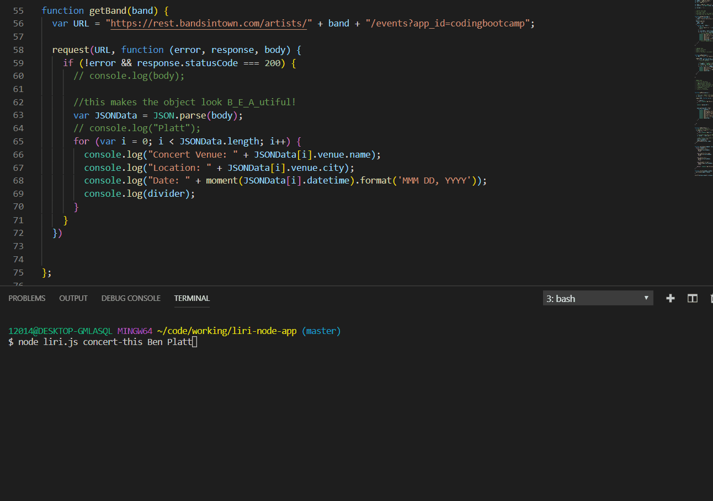
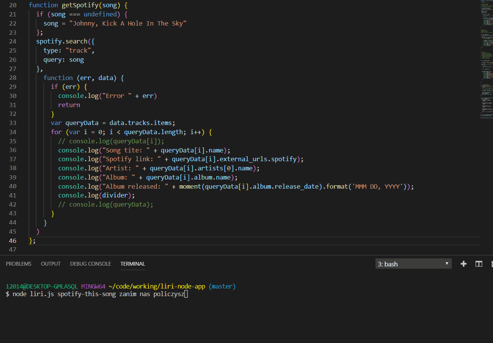
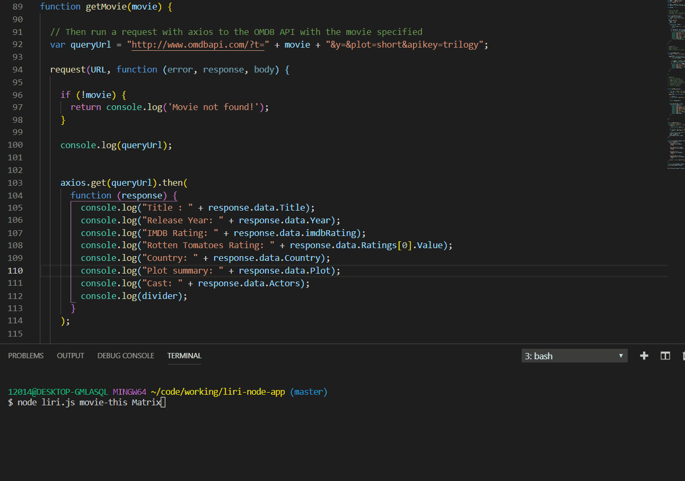
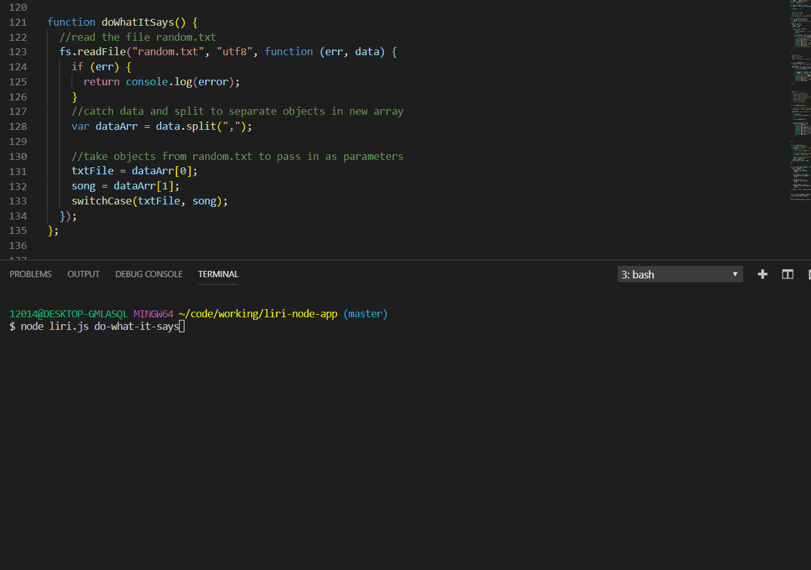

# Liri App

## Requirements
* Make a liri.js app that depends on user input from the command line
* Integrate BandsInTown, Spotify, and OMDb APIs via the appropriate NPM modules
* Use API calls and parse through returned JSON objects, outputting them in a specified format
* Read commands and queries from file
## Technologies Used
* Node.js
* JavaScript
* BandsInTown API 
* Spotify API 
* OMDb API 

## Command line walkthrough 

These instructions will get you a copy of the project up and running on your local machine for development and testing purposes. See deployment for notes on how to deploy the project on a live system.

### concert-this

This will search the Bands in Town Artist Events API  for an artist and render the following information about each event to the terminal:

* Name of the venue

* Venue location

* Date of the Event (use moment to format this as "MMM DD, YYYY")

### spotify-this-song

### movie-this

### do-what-it-says

